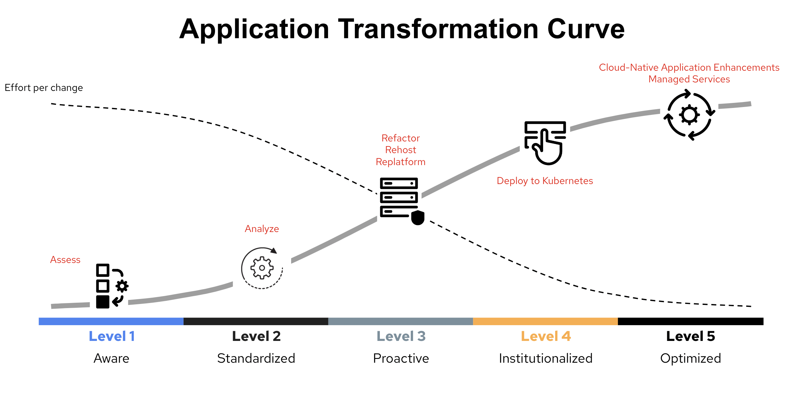

# Demo for Modern Application Transformation Process

This demo aims to address the need for a DevSecOps framework that accelerates development, provides easy deployment options, and allows for quick and easy way to add new product features and extensions to enterprise applications.

## Business Goals

1) Improve Customer Satisfaction
2) Improve Employee Satisfaction
3) Improve Culture break down Silos between Dev, Ops and Security Teams
4) Improve Revenue and Cost Streams
5) Increase Market Share/Leadership position

## Business to IT Goal Alignment (IT Value)

The demo will illustrate the following IT goals via specific examples listed below:

* **Integration**:  Self-Service Capability of Application Framework
* **Deployment**:   Ease of Application Deployments (net-new or releases)
* **Scalability**:  On-Demand Application scaling
* **Reliability**:  Container Security Regardless of Location (on-prem or cloud)
* **Developer productivity and Business Agility**: Automate CI/CD Pipeline Automation

Take a look at the following chart to understand how users and organizations define application transformation model as well as top reasons for modernization.

## Key Takeaways Business Values

* Reduce time to market by accelerating development, testing and deployment
* Implement standardization and compliance
* Modernization has a broad spectrum of definitions, but containerizing and automation rank high. 
* The containerizing is a broad enough trend to encompass multiple strategies including refactoring with Microservices. 
* Increasing scalability and reliability are key reasons for modernization.

## Technology Stack

* Red Hat Enterprise Virtualization
* Red Hat Runtimes (Quarkus, Spring Boot, Node.js, Tomcat)
* Red Hat OpenShift (Pipeline, GitOps, Virtualization)
* Oracle Database and PostgreSQL

## Instruction

1. [Introduction](instructions/1-introduction.adoc)
2. [Assessment](instructions/2-assessment.adoc)
3. [Analyze](instructions/3-analyze.adoc)
4. [Refactor](instructions/4-refactor.adoc)
5. [Rehost](instructions/5-rehost.adoc)
6. [Deploy to Kubernetes](instructions/6-deploy-to-kubernetes.adoc)
7. [Enhance Applications with Managed Services](instructions/7-enhance-apps.adoc)
8. [Summary](instructions/8-summary.adoc)
